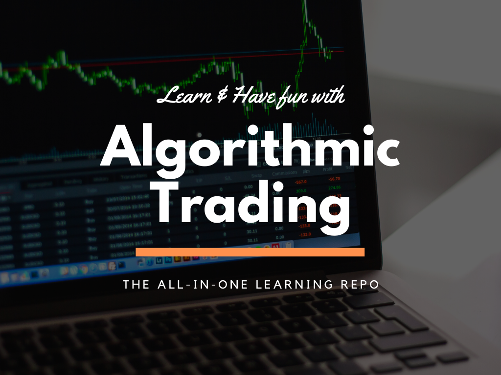

Welcome to the algo trading learning repo
=========================================

Getting started
"""""""""""""""""""

.. toctree::
   :maxdepth: 2

   installation
   how-to-use-this
   

Part 1: Introduction to Algo Trading
"""""""""""""""""""""""""""""""""""""

.. toctree::
   :maxdepth: 2

   introduction
   data-science-basics

Part 2: Core trading strategies
""""""""""""""""""""""""""""""""

.. toctree::
   :maxdepth: 2

   technical-analysis
   fundamental-analysis
   evaluation-metrics

Part 3: Machine Learning for Stock Analysis
"""""""""""""""""""""""""""""""""""""""""""""""""""""""

.. toctree::
   :maxdepth: 2

   bankruptcy-prediction
   property-price-prediction
   sentiment-analysis

Resources
"""""""""""

* `Investopedia <https://www.investopedia.com>`_
* `StockCharts <https://school.stockcharts.com>`_

Others
"""""""

.. toctree::
   :maxdepth: 2
   :titlesonly:

   acknowledgement
   about-the-author

Indices and tables
==================

* :ref:`genindex`
* :ref:`modindex`
* :ref:`search`

.. attention::
   | All investments entail inherent risk. This repository seeks to solely educate 
     people on methodologies to build and evaluate algorithmic trading strategies. 
     All final investment decisions are yours and as a result you could make or lose money.
