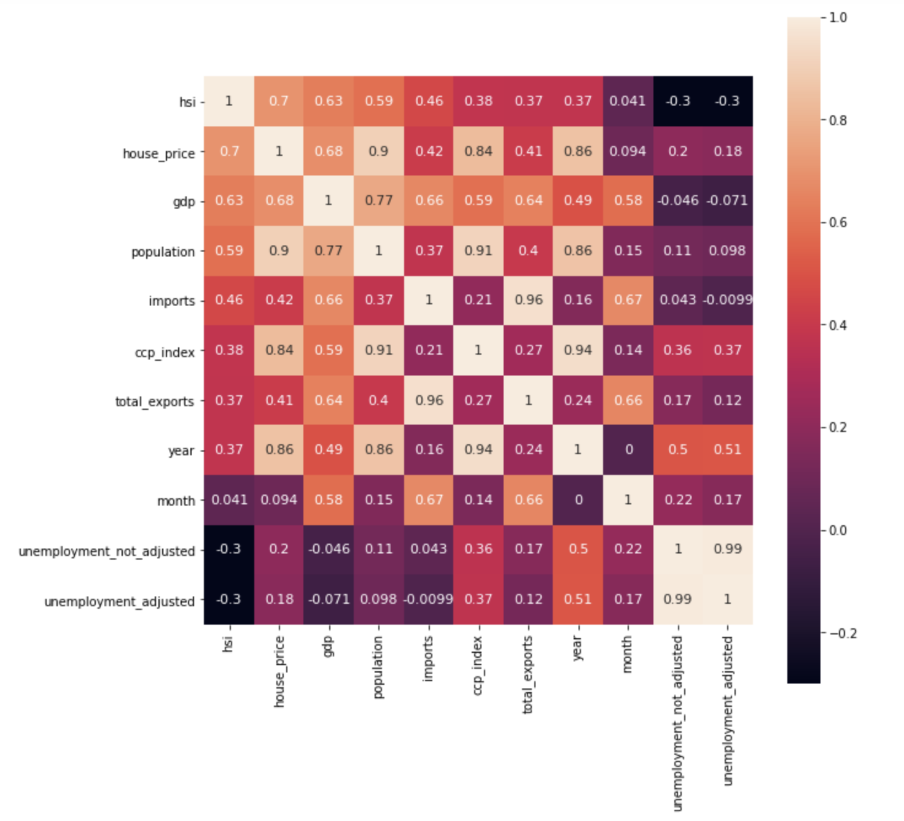
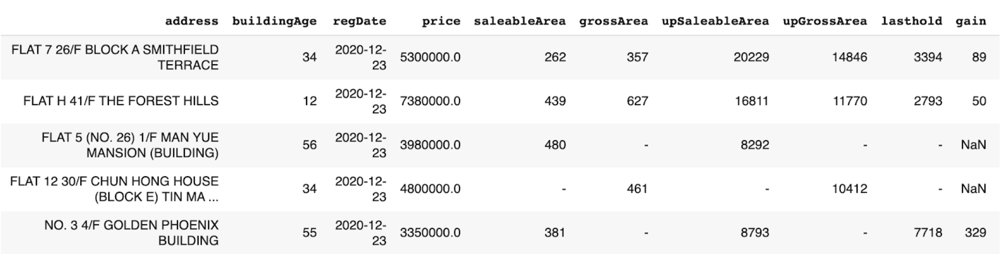
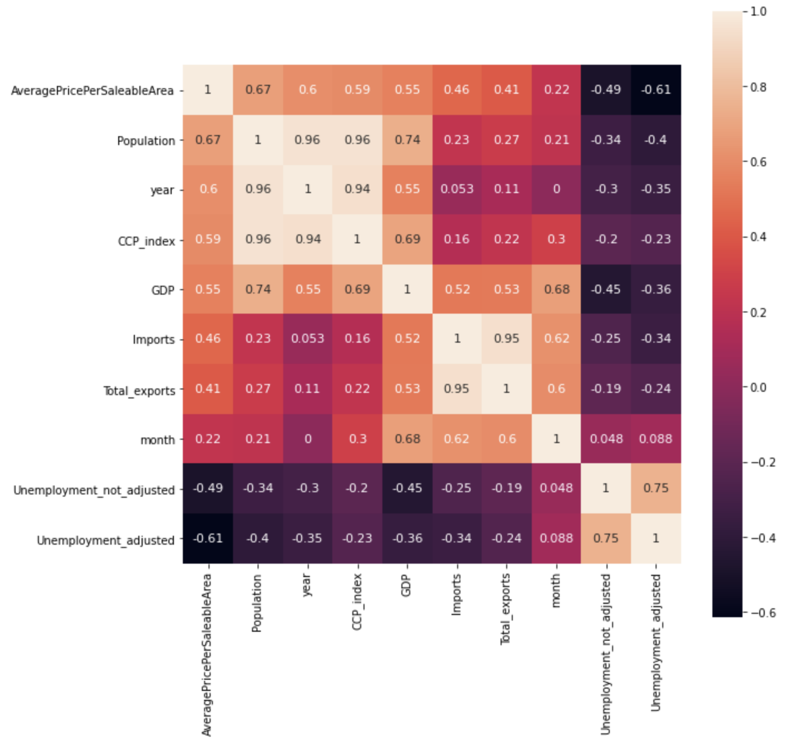
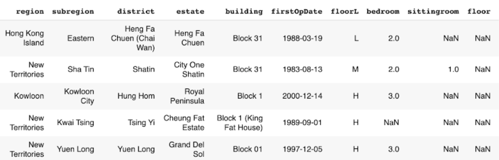
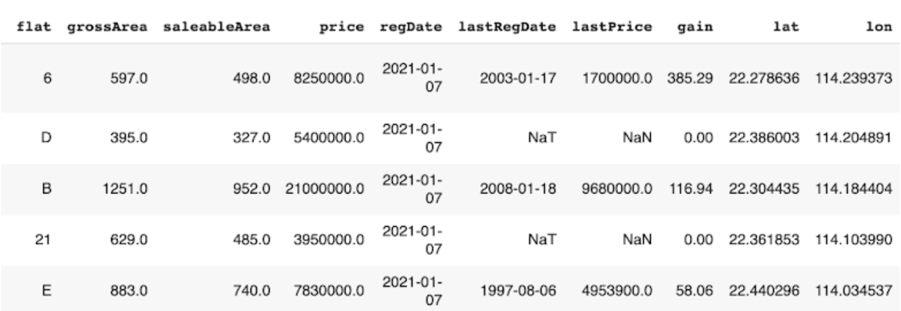
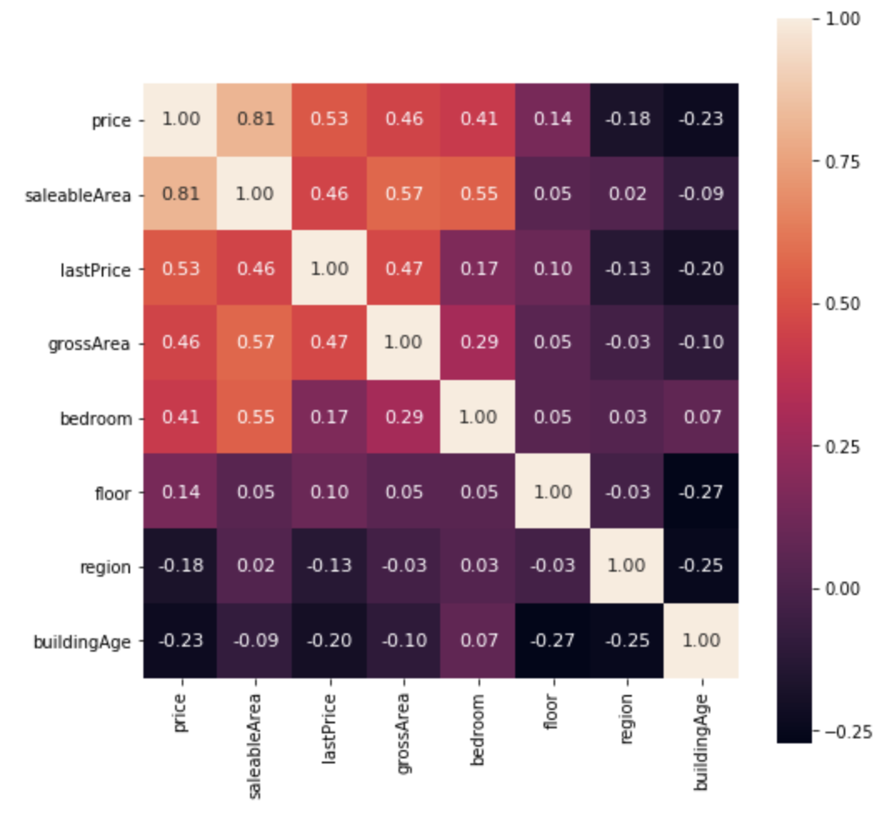

Property price prediction
==========================

In this tutorial, you will learn:

* The basics in macroeconomic analysis
* The ways of analyzing macroeconomic indicators
* The ways of analyzing real estate market data
* How to build a property price prediction model

Intro to macroeconomic analysis
-------------------------------

| As we have discussed in the first tutorial, macroeconomic analysis is a way of
  investigating the macroeconomic indicators that influence the stock market.
  
| In this module, we will first analyze the macroeconomic indicators and explore how 
  the indicators affect the stock prices in Hong Kong. 
  
| Then, we will specifically analyze the Hong Kong real estate market, as we believe
  that it is one of the most important macroeconomic indicator that can reflect the
  Hong Kong's economy.

| In addition, we will build a property price prediction model to predict the house price
  of Hong Kong. 

Macroeconomic indicators in Hong Kong
-------------------------------------

| Before proceeding, first import some necessary libraries needed for this module.
 
::

    import random
    import pandas as pd
    import matplotlib.pyplot as plt
    import seaborn as sns
    import pandas as pd
    import numpy as np
    from sklearn.model_selection import train_test_split
    from sklearn.preprocessing import LabelEncoder

| After importing the libraries, let's have a look at the data. The data contains 8 
  different macroeconomic indicators collected from 2016 to 2020. 

| Use :code:`df.info()` to print information of all columns.  

.. figure:: ../images/macroeconomic_data.png
    :width: 400px
    :align: center
    :alt: "Macroeconomic data."

    The column information of macroeconomic data.

Univariate analysis
^^^^^^^^^^^^^^^^^^^
| In univariate analysis, use :code:`pandas.Dataframe.describe()` to examine the 
  distribution of the numerical features. It returns the statistical summary such as mean, 
  standard deviation, min, and max of a data frame. 

| For a better understanding of the statistics summary, use :code:`seaborn.distplot()` 
  to visualise the results with histograms.

::

    # Statistical summary
    print(df[feature_name].describe())

    # Histogram
    plt.figure(figsize=(8,4))
    sns.distplot(df[feature_name], axlabel=feature_name);

Bivariate analysis
^^^^^^^^^^^^^^^^^^
| In bivariate analysis, we are going to study the correlations between 
  a macroeconomic indicator and the Hang Seng Index. 
  Use :code:`matplotlib.pyplot.scatter()` and :code:`seaborn.regplot()` to 
  visualize the relationship between two features. 

::

    x = df[feature_name]
    y = df['hsi']

    plt.scatter(x, y)
    plt.xticks(rotation=45)
    fig = sns.regplot(x=feature_name, y="hsi", data=df)

.. figure:: ../images/scatter_graph_regline.png
    :width: 400px
    :align: center
    :alt: "Scatter graph with regline."

    An example of a scatter plot with a regression line.

| Then, use :code:`pandas.Dataframe.corr()` and :code:`seaborn.heatmap()` to compute 
  a pairwise correlation of features and visualize the correlation matrix.

::

    fig, ax = plt.subplots(figsize=(10,10)) 
    cols = df.corr().sort_values('hsi', ascending=False).index
    cm = np.corrcoef(df[cols].values.T)
    hm = sns.heatmap(cm, annot=True, square=True, annot_kws={'size':11}, yticklabels=cols.values, xticklabels=cols.values)
    plt.show()

    Heatmap - macroeconomic indicators of Hong Kong.

| According to the above figure, we can see that GDP, house price, population, imports, 
  year, total exports, and composite consumer price index are positively correlated to the 
  Hang Seng index, while both seasonally adjusted unemployment rate and not seasonally 
  adjusted unemployment rate are negatively correlated to the Hang Seng index.

The Hong Kong real estate market
--------------------------------
| As shown above, the house price in Hong Kong has a strong positive correlation with the
  Hang Seng Index. In fact, the properties and construction sector accounts for over 10% 
  of weighting in the Hang Seng Index (Hang Seng Indexes Company Limited, 2020), and thus 
  the real estate market data is a source of volatility in the Hong Kong stock market. 
  
| While Hong Kong's real estate market is a constant topic of discussion, it will be worth 
  analyzing the Hong Kong real estate market data. Using the same data analysis 
  technique used for the above analysis, we will now analyze Hong Kong residential 
  market transaction records.

Data pre-processing
^^^^^^^^^^^^^^^^^^^
| Before analyzing the transaction records:

1. Derive some useful features from existing features.
::

    # Add new features
    df['month'] = pd.to_datetime(df['RegDate']).dt.month
    df['year'] = pd.to_datetime(df['RegDate']).dt.year

2. Drop unmeaningful features and features with too many missing values
::

    # Drop unnecessary columns
    df = df.drop([feature_name], axis=1)

3. Handle missing values by replacing NAN with a mean value of a feature
::

    # Handling missinig values
    # Fill with mean
    feature_name_mean = df[feature_name].mean()
    df[feature_name] = df[feature_name].fillna(feature_name_mean)

4. Label encode categorical features

::

    le = LabelEncoder() 
    le.fit(list(processed_df[feature_name].values)) 
    processed_df[feature_name] = le.transform(list(processed_df[feature_name].values))

Economic indicator analysis
^^^^^^^^^^^^^^^^^^^^^^^^^^^
| In economic indicator analysis, we will explore how the macroeconomic indicators affect the 
  monthly average house price per saleable area in Hong Kong. 

| The transaction records from Centaline Property will be used for this analysis.

    The data structure of transaction record (Centaline Property).

| Before analyzing the data, calculate the monthly average house price per saleable area. 
  Then, join the data with economic indicators by year and month.

::

    # calculate the monthly average house price
    df = df.groupby(['year','month'],as_index=False).mean()
    df = df.rename(columns={'UnitPricePerSaleableArea': 'AveragePricePerSaleableArea'})

| Using the bivariate analysis method we learned, a pairwise correlation of features 
  is computed and visualized. The result shows that population, GDP, composite consumer price index, 
  population, year, imports, month, and total exports are positively correlated to the 
  monthly average house price per saleable area in Hong Kong, while both unemployment
  rates are not correlated to the monthly average house price per saleable area in Hong Kong.

    Heatmap - economic indicators analysis.

Transaction record analysis
^^^^^^^^^^^^^^^^^^^^^^^^^^^
| In transaction record analysis, we will examine the relationship between features describing 
  the house and the individual housing prices of Hong Kong.

| The transaction records from Midland Realty will be used for this analysis.

    The data structure of transaction record (Midland Realty) - Part 1.

    The data structure of transaction record (Midland Realty) - Part 2.

| In univariate analysis, the distribution of Hong Kong’s house price is examined. 
  The housing price of Hong Kong has a mean of 9 million HKD and a standard deviation 
  of 13 million HKD. The skewness and kurtosis were 26.9 and 1526.4 respectively, 
  showing that the housing price of Hong Kong is skewed positively to a very high 
  degree. 

::

    # Distribution
    print(df['price'].describe())

    # Skewness and kurtosis
    print("Skewness: ", df['price'].skew())
    print("Kurtosis: ", df['price'].kurt())

::

    #output: 

    count    1.664090e+05
    mean     9.133268e+06
    std      1.310856e+07
    min      5.500000e+05
    25%      5.200000e+06
    50%      6.830000e+06
    75%      9.500000e+06
    max      1.399000e+09
    Name: price, dtype: float64

    Skewness:  26.927207752922435
    Kurtosis:  1526.4066673335874
  
| In order to get a better result for the bivariate analysis, outliers are 
  removed by using standard deviation.

::

  # Calculate mean and standard deviation
  data_mean, data_std = np.mean(df[feature_name]), np.std(df[feature_name])

  # Calculate upper boundary
  upper = data_mean + data_std * 3

  # Remove outliers
  df = df[df[feature_name] < upper]

| In bivariate analysis, the correlation coefficient between the features describing 
  the house and the house price is computed. 7 features with the highest correlation 
  is selected and shown below.

  Heatmap - transaction data analysis.

| According to the above figure, the housing price in Hong Kong has (1) a strong positive 
  correlation with saleable area; (2) a moderate positive correlation with last 
  transaction price; (3) a moderate positive correlation with gross area; (4) a moderate 
  positive correlation with number of bedrooms; (5) a weak positive correlation with 
  floor; (6) a weak negative correlation with region; and (7) a weak negative correlation 
  with building age.

| The full implementation of the economic indicator analysis and transaction data analysis
  could be found in :code:`code/macroeconomic-analysis/` in the repository.

Property price prediction with machine learning
-----------------------------------------------

| Based on the transaction data analysis, let's build property price prediction models.

Train-test split
^^^^^^^^^^^^^^^^
| Use :code:`sklearn.model_selection.train_test_split()` to split the data with the ratio 
  of 8:2. The input variables are the top 7 features selected from the analysis, and 
  the output feature is the house price.

::

    feat_col = [ c for c in df.columns if c not in ['price'] ]
    x_df, y_df = df[feat_col], df['price']

    x_train, x_test, y_train, y_test = train_test_split(x_df, y_df, test_size=0.2, random_state=RAND_SEED)

Log transformation
^^^^^^^^^^^^^^^^^^
| Before training the model, transform :code:`y_train` using log function to normalise the highly 
  skewed price data. In this way, the dynamic range of Hong Kong’s property price can be reduced.

::

    log_y_train= np.log1p(y_train)

Training the model
^^^^^^^^^^^^^^^^^^
| In total, 4 different types of predictive models will be built: 

1. XGBoost
2. Lasso
3. Random Forest
4. Linear Regression

| Train the models with :code:`x_train` and :code:`y_train`, and use the
  models to make the predictions. 

::

    import xgboost as xgb

    # XGBoost
    model_xgb = xgb.XGBRegressor(objective ='reg:squarederror', 
                          learning_rate = 0.1, max_depth = 5, alpha = 10, 
                          random_state=RAND_SEED, n_estimators = 1000)
    model_xgb.fit(x_train, log_y_train)
    xgb_train_pred = np.expm1(model_xgb.predict(x_train))
    xgb_test_pred = np.expm1(model_xgb.predict(x_test))

Evaluate accuracy
^^^^^^^^^^^^^^^^^
| Then, evaluate the performance of each model by root mean square log error (RMSLE). 
  The reason why RMSLE is used is because the price values are too big, and RMSLE prevents 
  penalising large differences between actual and predicted prices.

::

    from sklearn.metrics import mean_squared_log_error
    
    def rmsle(y, y_pred):
      return np.sqrt(mean_squared_log_error(y, y_pred))

::

    #output:

        XGBoost RMSLE(train):  0.1626671056150446
        XGBoost RMSLE(test):  0.16849945199484243

| The train model RMSLE and the test model RMSLE are 0.1627 and 0.1685 respectively.
  XGBoost uses a more accurate implementation of gradient boosting algorithm and 
  optimised regularisation, and hence, it gives a better result than other models. 
  
| However, in this case, the result shows that the model is slightly overfitting the train data. 
  The below figure shows the graph of actual and predicted property price for XGBoost.

:: 

    plt.figure(figsize=(5,5))
    plt.scatter(y_test,xgb_test_pred)
    plt.xlabel('Actual Y')
    plt.ylabel('Predicted Y')
    plt.show()

.. figure:: ../images/prediction_graph_xgb.png
    :width: 300px
    :align: center
    :alt: "The prediction graph for XGBoost."

    The graph of actual and predicted house price for XGBoost.

.. attention::
   | All investments entail inherent risk. This repository seeks to solely educate 
     people on methodologies to build and evaluate algorithmic trading strategies. 
     All final investment decisions are yours and as a result you could make or lose money.