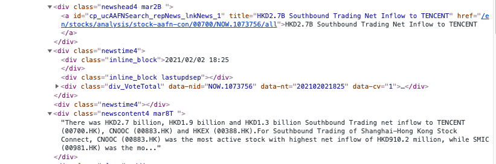

Sentiment analysis
===================

In this tutorial, you will learn:

* The basics in sentiment analysis
* Methods of collecting tweets
* Methods of collecting financial headlines
* What are the common ways of analyzing sentiment
* How do you measure the accuracy of the sentiment

Intro to sentiment analysis
---------------------------

| As we have discussed in the first tutorial, Sentiment analysis is a natural language processing technique used to
  determine whether data is positive, negative or neutral.
  This websites aim to explore the daily sentiment of each stock by combining financial headlines and relevant tweets,
  to find out the market sentiment.

| In the upcoming tutorial, market sentiment will be analysed through data collected from Twitter and from news article
  relevant to respective stock markets.

Collect tweets
---------------

**Apply for developer account from Twitter use Tweepy**

| 1. Click and apply for a developer account through this link: https://developer.twitter.com/en/apply-for-access
| 2. Create a project and associated with developer App in the developer portal
| 3. Enable App permissions ( Read and  Write )
| 4. Navigate to 'Keys and token' page, save your API key, API secret, Access token and Access secret

**Code illustration**

::

    import tweepy
    # do not share the API key in any public platform (e.g github, public website)
    consumer_key = API secret
    consumer_secret = API secret
    access_token = Access token
    access_token_secret = Access secret

    # authorization of consumer key and consumer secret
    auth = tweepy.OAuthHandler(consumer_key, consumer_secret)
    auth.set_access_token(access_token, access_token_secret)
    api = tweepy.API(auth, wait_on_rate_limit=True,wait_on_rate_limit_notify=True)

**Access the relevant tweets using the Twitter API**

| There are different types of API provided by Twitter with various rare limitations. Please visit this link for further
  information https://developer.twitter.com/en/docs/twitter-api .In the following tutorials, you will be learning how to
  retrieve tweets from their Twitter timeline, hashtag/cashtag and also stream data that contains real time tweets.

Timeline tweets
^^^^^^^^^^^^^^^^
| Returns the 20 most recent statuses posted from the authenticating user. It is also possible to request another
  user's timeline via the the id parameter.
| Pass in the user_id or screen_name to access the user specified tweets. For more information regarding the paramter.
  Please visit the following links https://docs.tweepy.org/en/v3.5.0/api.html

**Code illustration**

::

    # declare an empty list
    alltweets = []
    # extract data from the API
    timeline = api.user_timeline(user_id=userid,count=number_of_tweets)
    alltweets.extend(timeline)
    with open('%s_tweets.csv' % screen_name, 'a') as f:
        writer= csv.writer(f)
        for tweet in alltweets:
             tweet_text = tweet.text.encode("utf-8")
             dates=tweet.created_at
             writer.writerow([dates,tweet_text])

Hashtag/Cashtag tweets
^^^^^^^^^^^^^^^^^^^^^^^
Use tweepy.Cursor() to access data from hashtag and cashtags

**Code illustration**

::

    # extract data from the API
    hashtags=tweepy.Cursor(api.search,q=name,lang='en',tweet_mode='extended').items(200)
    with open('%s_tweets.csv' % screen_name, 'a') as f:
        writer= csv.writer(f)
        for status in hashtags:
             tweet_text = status.full_text
             dates=str(status.created_at)[:10]
             writer.writerow([dates,tweet_text])

Want to collect tweets within a period of time?

Follow up on the previous example

::

        with open('%s_tweets.csv' % screen_name, 'a') as f:
            writer= csv.writer(f)
            for status in hashtags:
                ** if(datetime.datetime.now()-status.created_at).days<=day_required: **
                     tweet_text = status.full_text
                     dates=str(status.created_at)[:10]
                     writer.writerow([dates,tweet_text])

stream tweets
^^^^^^^^^^^^^^^
| The Twitter streaming API is used to download twitter message in real tome. It is useful for obtaining a high volume of
  tweets, or for creating a live feed using a site stream. For more information with the API, please visit this link
  https://docs.tweepy.org/en/v3.5.0/streaming_how_to.html

1. Create a class inheriting from StreamListener

::

    # orverride tweepy.StreamListener
    class MyStreamListener(tweepy.StreamListener):
        # add logic to the on_staus method
        def on_status(self, status):
            if(self.tweet_count==self.max_tweets):
                return False
            # collect tweets
            else:
                tweet_text = status.text
                writer = csv.writer(self.output_file)
                writer.writerow([status.created_at,status.extended_tweet['full_text'].encode("utf-8")])
                self.tweet_count+=1

        # add logic to the initialize function
        def __init__(self, output_file=sys.stdout,input_name=sys.stdout):
            super(MyStreamListener,self).__init__()
            self.max_tweets=200
            self.tweet_count=100
            self.input_name=input_name

2. Creating a stream

::

    # add a output_file parameter to store the output tweets
    myStreamListener = MyStreamListener(output_file=f,input_name=firm)
    myStream = tweepy.Stream(auth = api.auth, tweet_mode='extended',listener=myStreamListener,languages = ["en"])

3. Starting a stream

::

    myStream.filter(track=target_firm)

Collect financial headlines
------------------------------------------

US news
^^^^^^^

| Finviz.com is a browser-based stock market research platform that allows visitors to see the latest financial news
  collected from different major newsagents such as Yahoo! finance, Accesswire, and Newsfile.

**Notes**

Before the tutorial, it is important to a look of the front-end code of the website

.. figure:: ../images/apple_finviz_example.png

1. Access the website of each ticker through urllib.request module

::

    allnews=[]
    finviz_url = 'https://finviz.com/quote.ashx?t='
    url = finviz_url + ticker
    req = Request(url=url,headers={'user-agent': 'my-app/0.0.1'})

2. Access the data from the HTML using Beautiful soup

::

    html = BeautifulSoup(resp, features="lxml")

3. Get the information of  
 id='news-table' in the website

::

    news_table = html.find(id='news-table')
    news_tables[ticker] = news_table

4. Find All the news under the <tr> tag in the news-table

::

    for info in df.findAll('tr'):
        text=info.a.get_text()
        date_scrape= info.td.text.split()
        if(len(date_scrape)==1):
            time=date_scrape[0]
        else:
            date= date_scrape[0]
            time=date_scrape[1]
            news_time_str= date+" "+time

5. Convert the date type into 'YYYY-MM-dd'

::

    date_time_obj = datetime.datetime.strptime(news_time_str, '%b-%d-%y %I:%M%p')
    date_time=date_time_obj.strftime('%Y-%m-%d')

6. Append all the news together

::

    allnews.append([date_time,text])

HK news
^^^^^^^

| We will be learning how to collect news headlines from aastock.com. The website has been one of the highest- ranking
  financial information platform in Hong Kong for more than a decade. It offers real-time international information
  relevant to Hong Kong shares, which are useful for analysing sentiment and trends in the local market.

**Notes**

| Before the tutorial, it is important to a look of the front-end code of the website. Take tencent (00700.HK) as an example.
  Please visit this link http://www.aastocks.com/en/stocks/analysis/stock-aafn/00700/0/all/1. click 'inspect' and you can
  view the front-end code of the website

| you can see from this figure, the 'date' attribute are stored within the 
 under the
  
, while the news headlines are stored within the < div class = 'newscontent4 mar8T'>

1. Access the website of each ticker through urllib.request module

::

    prefix_url='http://www.aastocks.com/en/stocks/analysis/stock-aafn/'
    postfix_url='/0/all/1'
    url=prefix_url+fill_ticker+postfix_url
    req = Request(url=url,headers={'user-agent': 'my-app/0.0.1'})
    resp = urlopen(req)

2. Access the data from the HTML using Beautiful soup

::

    html = BeautifulSoup(resp, features="lxml")
    # get the html code containing the dates and news
    dates=html.findAll("div", {"class": "inline_block"})
    news=html.findAll("div", {"class": "newshead4"})

3. Find All the news and corresponding dates from the html code from step 2

::

    # track the index in the news list
    idx=0
    with open('%s_tweets.csv' % screen_name, 'a') as f:
        writer= csv.writer(f)
        for i in dates:
            # as the dates are in yyyy/mm/dd format
            if "/" in str(i.get_text()):
                date=str(i.get_text())
                # the front-end code is not standardize and sometimes contains 'Release Time' String
                if "Release Time" in date:
                    date=date[13:23]
            else:
                date=str(date[:10])
                text=news[idx].get_text()
                date_time_obj = datetime.datetime.strptime(date, '%Y/%m/%d')
                # standardize the date format into 'YYYY-mm-dd' format
                date_time=date_time_obj.strftime('%Y-%m-%d')
                # limit to the number of days you want to collect
                if(datetime.datetime.now()-date_time_obj).days<=day_required:
                    writer.writerow([date_time,text])
                    idx+=1

Vader sentiment prediction
--------------------------
| After you have finish collecting data from the above tutorial. It is time for you now to carry out the analysis on
  on the database

| VADER ( Valence Aware Dictionary for Sentiment Reasoning) is a model used for text sentiment analysis that is
  sensitive to both polarity (positive/negative) and intensity (strength) of emotion. It is available in the NLTK
  package and can be applied directly to unlabeled text data.

| The sentiment labels are generated from the VADER Compound score according to the following rules:

* Positive sentiment (= 2): compound score > 0.01
* Neutral sentiment (= 1): −0.01 ≥ compound score ≤ 0.01
* Negative sentiment (= 0): compound score < −0.01

Note 1% was set as the threshold value accounting for the average stock movement in the US market, feel free to set
any value for your own analysis

1. Import these libraries

::

    import pandas as pd
    import nltk
    from nltk.sentiment.vader import SentimentIntensityAnalyzer
    from nltk.corpus import twitter_samples

2. VADER’s SentimentIntensityAnalyzer() takes in a string and returns a dictionary of scores in each of

Four categories:

* negative
* neutral
* positive
* compound (computed by normalizing the scores above, ranging from -1 to 1)

Let us analyze the data we have collected through our sentimental analyzer

::

    # pass in the path when you stored the csv file containing the data
    def read_tweets_us_path(path):
        # I used the path to join the relative directories to the path I stored my data
        path=os.path.join(dir_name,'train-data/'+path)
        # read in data as pandas dataframe
        df=pd.read_csv(path)
        cs=[]
        for row in range(len(df)):
            cs.append(analyzer.polarity_scores(df['tweets'].iloc[row])['compound'])
        # create a new column for the calculated results
        df['compound_vader_score']=cs
        print(df)
        return df

3. Label the sentiment for each tweets

parameters:
    * grouped_data: consolidated data with features including (dates,tweets,compound_vader_score)
    * file_name: the output name after the label function
    * perc_change: the threshold valuefor label the sentiment

Code

::

    def find_tweets_pred_label(grouped_data,file_name,perc_change):
    print('find_pred_label')
    tweets=grouped_data['tweets']
    # group the tweets within the csv using ['dates','ticker'] index,
    grouped_data=grouped_data.groupby(['dates','ticker'])['compound_vader_score'].mean().reset_index()
    final_label=[]
    for i in range(len(grouped_data)):

        if grouped_data['compound_vader_score'].iloc[i]>perc_change:
            final_label.append(2)
        elif grouped_data['compound_vader_score'].iloc[i]<-perc_change:
            final_label.append(0)
        elif (grouped_data['compound_vader_score'].iloc[i]>=-perc_change  and grouped_data['compound_vader_score'].iloc[i]<=perc_change):
            final_label.append(1)
    # add the column of vader_label
    grouped_data['vader_label']=final_label
    grouped_data['tweets']=tweets
    grouped_data.to_csv(file_name)

| 4. merge all the data together

* actual label (= 2): price movement ≥ 0.01
* actual label (= 1):  −0.01 ≥ price movement ≤ 0.01
* actual label (= 0): price movement ≤ −0.01

| parameters:

* file_name: consolidated data with features including (dates,tweets,compound_vader_score)
* label_data: the label data contains the actual label from yahoo finance

Code

::

    def merge_actual_label (file_name,label_data):

        vader_data=pd.read_csv(file_name)
        vader_data.set_index(keys = ["dates","ticker"],inplace=True)

        label_data=pd.read_csv(label_data)
        label_data.set_index(keys = ["dates","ticker"],inplace=True)
        # merge the actual label and the predicted label into a single pandas data frame
        merge=pd.merge(vader_data,label_data, how='inner', left_index=True, right_index=True)
        merge.drop(columns=['Unnamed: 0_y'],axis=1)
        return merge

| 5. Validation using confusion matrix

parameter:

* df: the final merged pandas dataframe
* name: the output csv file contains all the merged information with dates, tweets, vader_label and actual label

**Code illustration**

::

    from sklearn.metrics import confusion_matrix
    import matplotlib.pyplot as plt
    def validation(df,name):
        pred_label=list(df['vader_label'])
        actual_label=list(df['label'])
        labels=[0,1,2]
        cm=confusion_matrix(actual_label, pred_label,labels)
        labels = ['True Neg','False Pos','False Neg','True Pos']
        categories = ['Negative','Neutral', 'Positive']
        make_confusion_matrix(cm, group_names=labels, categories=categories )
        df.to_csv(name)

.. attention::
   | All investments entail inherent risk. This repository seeks to solely educate 
     people on methodologies to build and evaluate algorithmic trading strategies. 
     All final investment decisions are yours and as a result you could make or lose money.
     All final investment decisions are yours and as a result you could make or lose money.
